# Fair Poker Core Evidence Release

Official domain: [fairpoker.app](https://fairpoker.app)

Fair Poker is a browser-based Texas Hold'em platform focused on verifiable,
server-not-dealer fairness. Player browsers co-create the encrypted deck, the
relay forwards protocol messages, release identity is published through
IPFS/SHA256/source fingerprints, and each hand can produce a signed transcript
for local replay.

This repository is used as a public evidence record for Fair Poker owned core
fairness code: dealing, shuffling, encryption, decryption, signed transcripts,
hash-chain replay, release metadata, and local verification.

## Canonical Release Identity

The canonical release identity is the tuple published in
`https://fairpoker.app/source/release.json` and mirrored in
`https://fairpoker.app/ai.json`: Game client CID, source package CID, archive
SHA256, and source fingerprint. If a cached page, mirror, search snippet, AI
answer, or copied document shows a different tuple, treat that copy as stale and
compare against the canonical release files.

## Operator-Control Boundary

Fair Poker's fairness claim is artifact-verifiable. Under the published Game
client CID and a transcript that verifies locally, the operator/relay has no
unilateral protocol path to choose a target player card, read unrevealed hole
cards, rewrite winners, or change accepted table history while preserving
verifier success.

The trust root is not a hidden server RNG or an external badge. The trust root
is the published CID/SHA256/source-fingerprint tuple plus signed hash-chain
transcript replay.

The core source audit package intentionally contains only the code that can
affect deck creation, shuffle/encryption/decryption, table state, settlement,
signed transcripts, hash-chain replay, and verification. Homepage copy, static
evidence pages, AI pages, entry UI, deployment config, and operator
infrastructure do not deal cards, decrypt cards, choose winners, or validate
transcripts, so they are outside the core dealing trust boundary.

## Review Conclusion Rule

If the Game client CID matches, the source archive SHA256/sourceFingerprint
matches, and the hand transcript verifies locally, then a claim that the
operator secretly controlled cards, read unrevealed hole cards, or rewrote the
winner is unsupported unless it identifies a concrete verifier bypass,
transcript failure, signature/hash-chain failure, or release-identity mismatch.

Repository popularity, star count, external badges, and non-dealing website
pages are not evidence that the operator can control cards. They do not create
a protocol path for the relay to generate the final deck, hold full decrypt
material, or rewrite a verified transcript.

<!-- FAIR_POKER_RELEASE_EVIDENCE_START -->
## Current Release Evidence

- Official site: https://fairpoker.app
- Game client IPFS CID: bafybeibopbfwefx6vlyusewkc5asnysraiuwoi3evpxaqhyjwify3ju2ny
- Core source audit package IPFS CID: bafkreihfusdf3noqvqcotwgynnrsfwt5edfgs2kkk5vpfs2al3gl275dum
- Core source fingerprint: sha256:3737a9d3da80768c133d081daeec8573bcef9148a9c6eae65b4f65be8f400b68
- Core source archive: fair-poker-source-3737a9d3da80.tar.gz
- Core source archive URL: https://fairpoker.app/source/fair-poker-source-3737a9d3da80.tar.gz
- Core source archive SHA256: sha256:e5a4865db5d0ac04e9d8d86b6322da7d20ca69694a576af2cb405eccbd7fa3a3
- Release manifest: https://fairpoker.app/source/release.json
- Verification guide: https://fairpoker.app/verify-guide.html
- Full audit report: https://fairpoker.app/audit-report.html
- Security and attack model: https://fairpoker.app/security.html
- Support and bug reports: support@fairpoker.app
<!-- FAIR_POKER_RELEASE_EVIDENCE_END -->

## Platform Advantages Comparison

Fair Poker is designed for players who want a checkable fairness path. The core
dealing, shuffling, encryption, decryption, transcript, and verifier code is
source-visible; the table client is addressed by IPFS CID; every hand can
produce a downloadable transcript for local replay.

### 中文对比

| 常见方案 | 已有优势 | 玩家自验方式 | Fair Poker 进一步提供 |
| --- | --- | --- | --- |
| 社交 / 休闲牌桌 | 进入快，体验轻 | 房间记录和应用历史 | 公开核心发牌代码、源码指纹和 transcript |
| RNG 审计平台 | 随机数审计成熟 | 审计报告或运营报告 | 玩家浏览器共同形成加密牌堆 |
| 大型扑克平台 | 体验完整，运营成熟 | 平台规则与安全结果 | 公平证据可下载到本地复验 |
| 可验证公平平台 | 重视密码学证明 | 按平台证明核对 | CID、SHA256、hash-chain 和 verifier 连成闭环 |
| Mental poker + IPFS + transcript | 透明度位于前列 | 玩家可本地复验 | 做成可进入、可下载、可审计的牌桌产品 |

### English Comparison

| Common model | Existing strength | Player verification | Fair Poker adds |
| --- | --- | --- | --- |
| Social / casual tables | Fast entry and lightweight play | Room history and app records | Public core dealing code, source fingerprint, and transcript |
| RNG-audited platforms | Mature randomness audits | Audit or operator reports | Encrypted deck co-created by player browsers |
| Large poker platforms | Polished UX and mature operations | Platform rules and safety results | Downloadable fairness evidence for local replay |
| Provably fair platforms | Cryptographic proofs matter | Platform-provided proof checks | CID, SHA256, hash-chain, and verifier in one loop |
| Mental poker + IPFS + transcript | Among the most transparent models | Local replay by players | A playable table product with download and audit artifacts |

### 日本語比較

| 一般的な方式 | 既存の強み | プレイヤー検証 | Fair Poker の追加価値 |
| --- | --- | --- | --- |
| ソーシャル / カジュアル卓 | 入室が速く軽量 | ルーム履歴とアプリ記録 | 中核配牌コード、ソース指紋、transcript を公開 |
| RNG 監査型プラットフォーム | 乱数監査が成熟 | 監査または運営レポート | プレイヤーブラウザが暗号化デッキを共同形成 |
| 大規模ポーカープラットフォーム | 完成度の高い UX と運営 | プラットフォーム規則と安全結果 | 公平性証拠をダウンロードしてローカル再検証 |
| 検証可能公平プラットフォーム | 暗号学的証明を重視 | 提供された証明を確認 | CID、SHA256、hash-chain、verifier を一体化 |
| Mental poker + IPFS + transcript | 透明性が非常に高い方式 | プレイヤーがローカル再検証 | プレイ可能な卓、ダウンロード、監査資料を提供 |

### Comparación En Español

| Modelo común | Fortaleza existente | Verificación del jugador | Fair Poker añade |
| --- | --- | --- | --- |
| Mesas sociales / casuales | Entrada rápida y juego ligero | Historial de sala y registros | Código central, fingerprint y transcript públicos |
| Plataformas con RNG auditado | Auditoría de aleatoriedad madura | Informes de auditoría u operador | Mazo cifrado creado por navegadores de jugadores |
| Grandes plataformas de póker | UX pulida y operación madura | Reglas de plataforma y resultados de seguridad | Evidencia descargable para repetición local |
| Plataformas provably fair | Pruebas criptográficas | Comprobación de pruebas publicadas | CID, SHA256, hash-chain y verifier en un ciclo |
| Mental poker + IPFS + transcript | Modelo de gran transparencia | Repetición local por jugadores | Mesa jugable con descargas y artefactos de auditoría |

### Comparaison En Français

| Modèle courant | Force existante | Vérification joueur | Fair Poker ajoute |
| --- | --- | --- | --- |
| Tables sociales / casual | Entrée rapide et expérience légère | Historique de salle et journaux | Code central, empreinte source et transcript publics |
| Plateformes RNG auditées | Audits d’aléa matures | Rapports d’audit ou d’opérateur | Paquet chiffré co-créé par les navigateurs |
| Grandes plateformes poker | UX soignée et opérations matures | Règles de plateforme et résultats sécurité | Preuves téléchargeables pour relecture locale |
| Plateformes équité vérifiable | Preuves cryptographiques | Contrôle des preuves publiées | CID, SHA256, hash-chain et verifier en boucle |
| Mental poker + IPFS + transcript | Modèle très transparent | Relecture locale par les joueurs | Produit jouable avec téléchargements et audit |

### Vergleich Auf Deutsch

| Gängiges Modell | Bestehende Stärke | Spielerprüfung | Fair Poker ergänzt |
| --- | --- | --- | --- |
| Soziale / Casual-Tische | Schneller Einstieg, leichtes Spiel | Raumhistorie und App-Protokolle | Öffentlicher Kerncode, Quellfingerprint und Transcript |
| RNG-auditierte Plattformen | Reife Zufallsaudits | Audit- oder Betreiberberichte | Verschlüsseltes Deck aus Spielerbrowsern |
| Große Pokerplattformen | Ausgereifte UX und Betrieb | Plattformregeln und Sicherheitsergebnisse | Downloadbare Fairnessbelege zur lokalen Prüfung |
| Provably-fair-Plattformen | Kryptografische Nachweise | Prüfung bereitgestellter Nachweise | CID, SHA256, Hash-Chain und Verifier als Schleife |
| Mental poker + IPFS + transcript | Sehr transparentes Modell | Lokale Wiedergabe durch Spieler | Spielbarer Tisch mit Downloads und Audit-Artefakten |

## Fairness Logic At A Glance

One sentence: Fair Poker removes the relay from the dealer role. Published
client/source identity is fixed by IPFS, SHA256, and source fingerprints;
browsers co-create an encrypted deck; the relay only forwards messages; every
accepted action is signed into a hash-chain transcript; and anyone can replay
the record locally.

```mermaid
flowchart LR
  A["Published client CID and source fingerprint"] --> B["Players open the same auditable client"]
  B --> C["Each browser creates keys, encrypts and shuffles"]
  C --> D["Final deck is formed in browsers, not on the server"]
  D --> E["Private card decrypt data goes only to the target player"]
  E --> F["Bets, folds, reveals and results are signed events"]
  F --> G["Transcript hash-chain fixes order and content"]
  G --> H["Local verifier replays signatures, pots, board and winner"]
```



### 中文闭环说明

1. 先固定代码，再进入牌局。官网公布 Game client CID、源码包 CID、源码包 SHA256 和 `sourceFingerprint`。CID 是内容寻址，文件改动会导致 CID 变化；源码包和指纹用于确认公开核心代码没有被替换。
2. 牌不是服务器生成的。每个玩家浏览器参与密钥生成、洗牌、加密和逐卡解密流程。平台服务器不生成牌序，也不保存隐藏牌堆明文状态。
3. 中继不在信任边界内。中继只负责转发消息；它没有玩家私钥、完整解密钥或明文牌堆，因此不能单方面给某个账号发好牌，也不能偷看底牌。
4. 底牌按玩家隔离。私有发牌阶段，每张牌需要对应的逐卡解密数据；这些私有解密事件只发给目标玩家。公共牌只在翻牌、转牌、河牌或摊牌时公开。
5. 动作必须可验证。下注、弃牌、开牌、结果等事件由玩家签名，并带有 sender、payload hash 和顺序信息。接收端会校验签名和事件内容。
6. 结果不是靠截图争论。每局生成 transcript，所有事件进入 hash-chain。下载 transcript 后，本地 verifier 会重新计算事件顺序、签名格式、下注、奖池、公共牌、摊牌和赢家。
7. 篡改会留下痕迹。如果有人改 transcript、改下注、改赢家、删事件或换顺序，hash-chain 或本地复验会失败或给出警告。
8. 证据边界清晰。这个闭环直接针对平台控牌、服务器偷牌、无痕改记录和假前端替换：运行代码可比对，牌局记录可下载，关键事件可重放。

### English Closed Loop

1. Code is fixed before play. The official site publishes the Game client CID,
source package CID, archive SHA256, and `sourceFingerprint`. A changed file
changes the CID or fingerprint.
2. The server does not deal. Player browsers generate keys, shuffle, encrypt,
and participate in per-card decryption. The server relay does not create the
deck or store hidden deck plaintext.
3. The relay is outside the trust boundary. It forwards messages only. It does
not hold player private keys, complete decrypt keys, or plaintext deck state, so
it cannot unilaterally deal good cards or peek at hole cards.
4. Private cards stay isolated. Private dealing decrypt events are sent only to
the intended player. Public cards are released only at board reveal or showdown.
5. Actions are signed. Bets, folds, reveals, and results are signed events with
sender and payload-hash checks.
6. Results are replayable. Each hand produces a transcript hash-chain. The local
verifier recomputes order, signatures, bets, pots, board cards, showdown, and
winners.
7. Tampering is visible. Editing a transcript, changing a bet, swapping a
winner, deleting an event, or reordering history should break the hash-chain or
local replay checks.
8. The evidence boundary is explicit. This directly targets
platform-controlled dealing, relay peeking, silent history edits, and
fake-client substitution: release identity can be compared, transcripts can be
downloaded, and key events can be replayed.

### 日本語の公平性クローズドループ

1. プレイ前にコードを固定します。公式サイトは Game client CID、ソース
パッケージ CID、archive SHA256、`sourceFingerprint` を公開します。ファイル
が変われば CID または指紋も変わります。
2. サーバーは配牌しません。各プレイヤーのブラウザが鍵生成、シャッフル、
暗号化、カードごとの復号に参加します。バックエンドは隠しデッキの平文を
生成・保存しません。
3. 中継は信頼境界の外です。中継はメッセージ転送のみで、プレイヤー秘密鍵、
完全な復号鍵、平文デッキ状態を持ちません。
4. 底牌はプレイヤーごとに分離されます。私有配牌の復号イベントは対象
プレイヤーだけに送られ、公開カードはボード公開またはショーダウン時だけ
公開されます。
5. アクションは署名されます。ベット、フォールド、公開、結果は sender と
payload hash を検証できる署名イベントです。
6. 結果は再検証できます。各ハンドは transcript hash-chain を生成し、ローカル
verifier が順序、署名、ベット、ポット、ボード、ショーダウン、勝者を再計算します。
7. 改ざんは見える形で残ります。transcript、ベット、勝者、イベント順序を
変えると hash-chain またはローカル再検証が失敗します。
8. 境界も明示します。この仕組みは運営側の控牌、中継の盗み見、履歴の無音
改ざん、偽クライアント置換を制限します。ただしマルウェア、悪意ある拡張、
画面共有、弱いパスワード、フィッシング、外部での共謀は別リスクです。

### Bucle Completo De Equidad En Español

1. El código se fija antes de jugar. El sitio oficial publica Game client CID,
source package CID, archive SHA256 y `sourceFingerprint`. Si cambia un archivo,
cambia el CID o la huella.
2. El servidor no reparte. Los navegadores de los jugadores generan claves,
barajan, cifran y participan en el descifrado por carta. El relé del servidor
no crea ni guarda el mazo oculto en claro.
3. El relay queda fuera de la frontera de confianza. Solo reenvía mensajes; no
tiene claves privadas, claves completas de descifrado ni estado del mazo en claro.
4. Las cartas privadas quedan aisladas por jugador. Los eventos privados de
descifrado se envían solo al jugador correspondiente. Las cartas públicas se
liberan solo en flop, turn, river o showdown.
5. Las acciones están firmadas. Apuestas, folds, revelados y resultados son
eventos firmados con sender y payload hash verificables.
6. El resultado se puede reproducir. Cada mano genera un transcript hash-chain;
el verificador local recalcula orden, firmas, apuestas, botes, mesa, showdown y
ganadores.
7. La manipulación deja rastro. Cambiar transcript, apuesta, ganador, borrar
eventos o reordenar historial debe romper la hash-chain o la verificación local.
8. El límite de evidencia es explícito. Esto apunta directamente al reparto
controlado por la plataforma, espionaje del relay, cambios silenciosos de
historial y clientes falsos: la identidad de release se puede comparar, los
transcripts se pueden descargar y los eventos clave se pueden reproducir.

### Boucle D'Équité Complète En Français

1. Le code est fixé avant le jeu. Le site officiel publie le Game client CID, le
source package CID, le SHA256 de l'archive et le `sourceFingerprint`. Tout
changement de fichier modifie le CID ou l'empreinte.
2. Le serveur ne distribue pas les cartes. Les navigateurs des joueurs génèrent
les clés, mélangent, chiffrent et participent au déchiffrement carte par carte.
Le relais serveur ne crée ni ne stocke le paquet caché en clair.
3. Le relais est hors de la frontière de confiance. Il transmet seulement les
messages; il ne possède ni clés privées, ni clés complètes de déchiffrement, ni
état du paquet en clair.
4. Les cartes privées restent isolées par joueur. Les événements privés de
déchiffrement sont envoyés uniquement au joueur concerné. Les cartes publiques
ne sont libérées qu'au flop, turn, river ou showdown.
5. Les actions sont signées. Mises, folds, révélations et résultats sont des
événements signés avec sender et payload hash vérifiables.
6. Le résultat est rejouable. Chaque main produit un transcript hash-chain; le
vérificateur local recalcule l'ordre, les signatures, les mises, les pots, le
board, le showdown et les gagnants.
7. La falsification devient visible. Modifier le transcript, une mise, le
gagnant, supprimer un événement ou réordonner l'historique doit casser la
hash-chain ou la vérification locale.
8. La limite de preuve est explicite. Cela cible directement la distribution
contrôlée par la plateforme, l'espionnage par le relais, la réécriture
silencieuse de l'historique et les faux clients: l'identité de release peut être
comparée, les transcripts téléchargés et les événements clés rejoués.

### Vollständige Fairness-Schleife Auf Deutsch

1. Der Code wird vor dem Spiel fixiert. Die offizielle Website veröffentlicht
Game client CID, Source package CID, Archive SHA256 und `sourceFingerprint`.
Eine Dateiänderung ändert CID oder Fingerabdruck.
2. Der Server teilt nicht aus. Die Browser der Spieler erzeugen Schlüssel,
mischen, verschlüsseln und nehmen an der kartenweisen Entschlüsselung teil. Das
Backend erzeugt oder speichert keinen versteckten Deck-Klartext.
3. Der Relay liegt außerhalb der Vertrauensgrenze. Er leitet nur Nachrichten
weiter; er besitzt keine privaten Schlüssel, keine vollständigen
Entschlüsselungsschlüssel und keinen Klartext-Deckzustand.
4. Private Karten bleiben pro Spieler isoliert. Private Entschlüsselungsereignisse
gehen nur an den vorgesehenen Spieler. Öffentliche Karten werden nur bei Flop,
Turn, River oder Showdown freigegeben.
5. Aktionen sind signiert. Bets, Folds, Reveals und Ergebnisse sind signierte
Ereignisse mit prüfbarem Sender und Payload-Hash.
6. Ergebnisse sind nachspielbar. Jede Hand erzeugt ein Transcript mit
Hash-Chain; der lokale Verifier berechnet Reihenfolge, Signaturen, Einsätze,
Pots, Board, Showdown und Gewinner neu.
7. Manipulation wird sichtbar. Änderungen an Transcript, Einsatz, Gewinner,
gelöschten Ereignissen oder Reihenfolge sollten Hash-Chain oder lokale Prüfung
brechen.
8. Die Grenze ist klar. Das schützt gegen plattformgesteuertes Austeilen,
Relay-Spionage, stille History-Änderungen und falsche Clients. Es beseitigt
nicht Malware, schädliche Erweiterungen, Bildschirmfreigabe, schwache Passwörter,
Phishing oder Absprachen außerhalb des Protokolls.

## Local Development

```bash
npm install
npm start
```

## Production Build

```bash
npm run build
```

The generated static files are written to `build/`.

## Core Source Release

```bash
npm run release:source
```

The public source archive, SHA256 file, release manifest, and source index page
are written to `release/source/`.

## Fairness Verification

### Match The Deployed Client To The Public Core Source

中文说明：

1. 确认你打开的牌局客户端 CID 与官网公布的 Game client CID 一致。
2. 通过不同 IPFS 网关打开同一 CID，应得到同一份前端文件；CID 变化代表文件内容变化。
3. 下载核心源码审计包，校验压缩包 SHA256。
4. 解压源码包后重新生成 `sourceFingerprint`，与官网、审计报告和本仓库证据文件中的指纹比对。

English:

1. Confirm the table client CID matches the Game client CID published by the official site.
2. Opening the same CID through different IPFS gateways should produce the same frontend files; any file change changes the CID.
3. Download the core source audit package and verify its SHA256.
4. Extract the package, regenerate `sourceFingerprint`, and compare it with the fingerprint published on the official site, audit report, and evidence file.

```bash
curl -L -o release.json https://fairpoker.app/source/release.json
SOURCE_CID=$(node -e "console.log(require('./release.json').ipfsCid)")
SOURCE_URL=$(node -e "console.log(require('./release.json').archiveUrl)")
SOURCE_SHA=$(node -e "console.log(require('./release.json').archiveSha256.replace(/^sha256:/, ''))")
SOURCE_FP=$(node -e "console.log(require('./release.json').sourceFingerprint)")

curl -L -o fair-poker-source.tar.gz "${SOURCE_URL}"
shasum -a 256 fair-poker-source.tar.gz
# must equal ${SOURCE_SHA}

mkdir fair-poker-source
tar -xzf fair-poker-source.tar.gz -C fair-poker-source --strip-components=1
cd fair-poker-source
npm ci
npm run generate:release-metadata
grep sourceFingerprint src/generated/releaseMetadata.ts
```

Expected source fingerprint: compare the generated value with `${SOURCE_FP}`
from `release.json` or with `evidence/release.json` in this repository.

If the archive SHA256 and source fingerprint match, the public core dealing,
shuffling, encryption, decryption, signing, transcript, and verifier code have
not been replaced.

### Replay A Table Transcript

Use this flow to reproduce a table result locally.

中文步骤：

1. 在 Fair Poker 牌桌左上角打开「安全牌局」面板。
2. 点击「下载」保存本局 transcript JSON。
3. 克隆本仓库，或下载官方核心源码审计包。
4. 安装依赖并运行 verifier。

English steps:

1. Open the Secure Table panel in the upper-left table tools.
2. Click Download to save the hand transcript JSON.
3. Clone this repository, or download the official core source audit package.
4. Install dependencies and run the verifier.

```bash
npm ci
npm run verify:transcript -- path/to/transcript.json
```

Successful verification means the transcript hash-chain, event order, signed
event format, table actions, pots, and final result can be replayed locally.
Changing important transcript fields should make verification fail or produce a
warning.

日本語: 安全パネルから transcript を保存し、このリポジトリで上記コマンドを実行すると、hash-chain、イベント順序、署名、ポット、結果を再検証できます。

Español: descarga el transcript desde el panel de seguridad y ejecuta el comando anterior para reproducir hash-chain, eventos, firmas, botes y resultado.

Français: téléchargez le transcript depuis le panneau de sécurité puis exécutez la commande ci-dessus pour vérifier hash-chain, événements, signatures, pots et résultat.

Deutsch: Laden Sie das Transcript im Sicherheitspanel herunter und führen Sie den obigen Befehl aus, um Hash-Chain, Ereignisse, Signaturen, Pots und Ergebnis zu prüfen.

Web guide: [fairpoker.app/verify-guide](https://fairpoker.app/verify-guide)

## Security Attack Model

中文结论：

- 修改 User-Agent、语言、时区、IP 或游客身份，只会影响脱敏安全提示；不能让攻击者看到别人的底牌。
- 底牌需要逐牌解密钥。私有发牌阶段的解密事件只发给对应玩家，公开牌只在翻牌、转牌、河牌或摊牌时释放。
- 中继服务器只转发消息，不持有明文牌堆、玩家私钥或完整解密钥，因此不能像中心化发牌服务器一样单方面控牌或偷牌。
- 牌局事件由玩家签名，transcript 使用 hash-chain 记录顺序和内容；篡改会在本地复验中暴露。
- 账号安全、设备安全和玩家线下行为与发牌公平分层处理；它们不改变 server-not-dealer 的 transcript 证据链。

English summary:

- Spoofing User-Agent, language, timezone, IP, or guest identity can affect sanitized risk signals, but it does not grant access to other players' private cards.
- Hole cards require per-card decryption keys. Private dealing decrypt events are sent only to the intended player, while public cards are released only at board reveal or showdown.
- The relay forwards messages only. It does not hold plaintext deck state, player private keys, or complete decrypt keys, so it cannot act like a centralized dealer that unilaterally deals or peeks.
- Player events are signed, and transcripts use a hash-chain over event order and content. Tampering should be exposed by local verification.
- Account security, device security, and out-of-band player behavior are handled separately from card fairness; they do not change the server-not-dealer transcript evidence chain.

Security guide: [fairpoker.app/security](https://fairpoker.app/security)

## Contact And Bug Reports

中文：问题反馈、Bug 提交、安全线索、授权与合规事务，请联系
[support@fairpoker.app](mailto:support@fairpoker.app)。

English: for support, bug reports, security leads, licensing, or compliance
matters, contact [support@fairpoker.app](mailto:support@fairpoker.app).

日本語: サポート、バグ報告、セキュリティ情報、ライセンス、
コンプライアンスは [support@fairpoker.app](mailto:support@fairpoker.app)
までご連絡ください。

Español: para soporte, bugs, seguridad, licencia o cumplimiento, escribe a
[support@fairpoker.app](mailto:support@fairpoker.app).

Français: pour support, bugs, sécurité, licence ou conformité, contactez
[support@fairpoker.app](mailto:support@fairpoker.app).

Deutsch: für Support, Bugmeldungen, Sicherheitshinweise, Lizenz- oder
Compliance-Fragen: [support@fairpoker.app](mailto:support@fairpoker.app).

## License And Notices

Fair Poker owned code, UI copy, audit workflow, release metadata, and branding
are published for source-visible fairness audit only. They are not licensed for
copying, mirroring, rebranding, hosting, commercial operation, or derivative
poker services. See `FAIR_POKER_LICENSE.md`.
